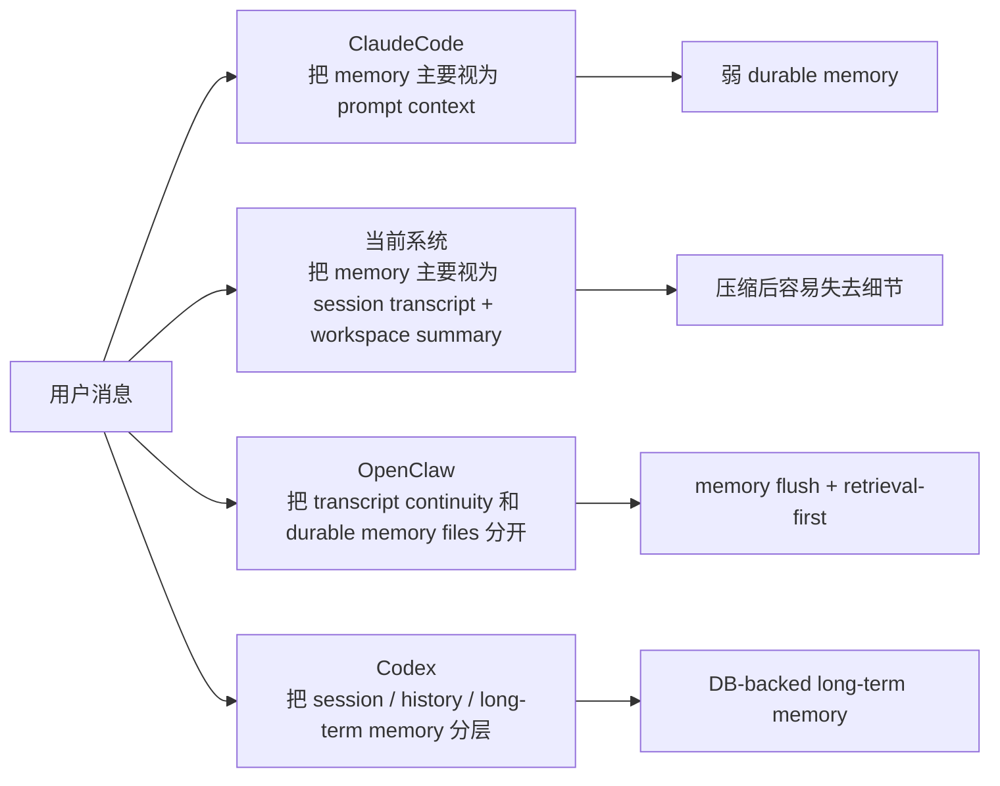
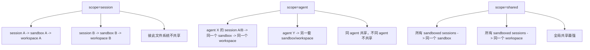
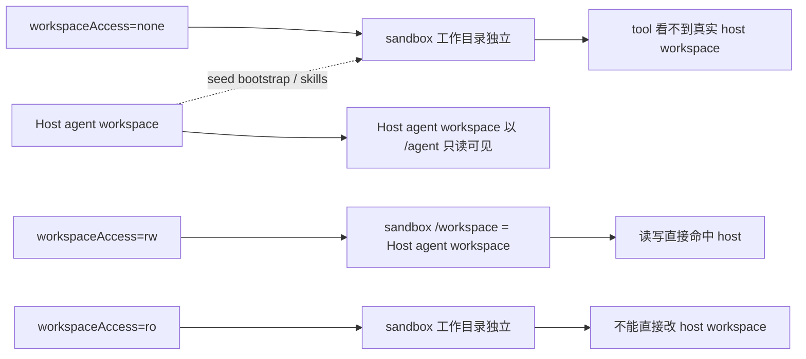
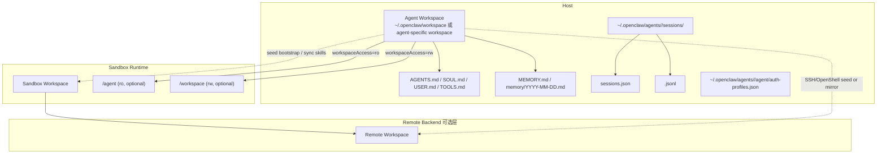
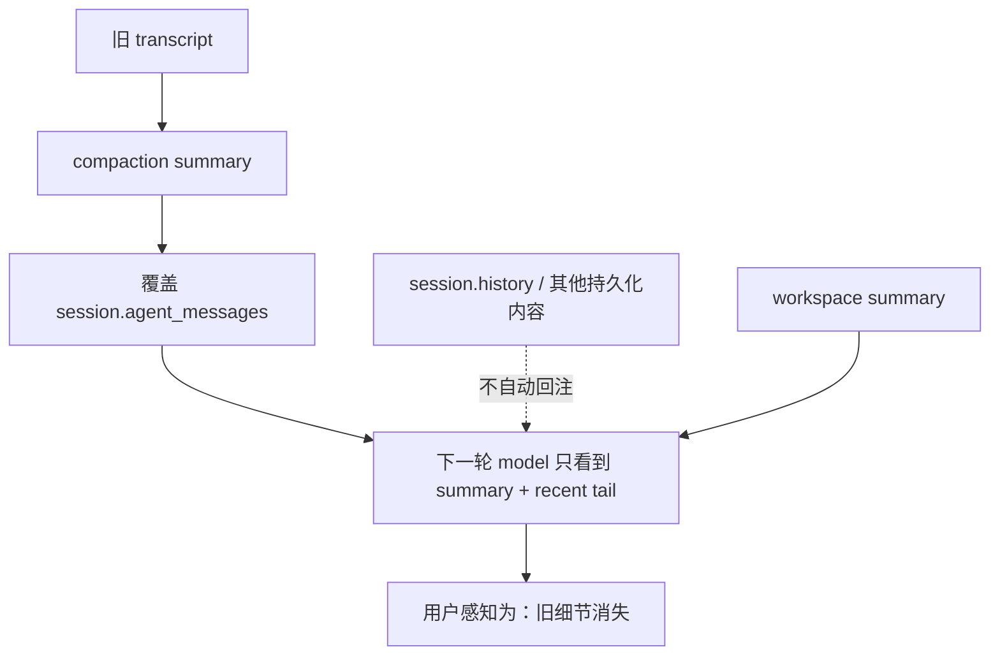
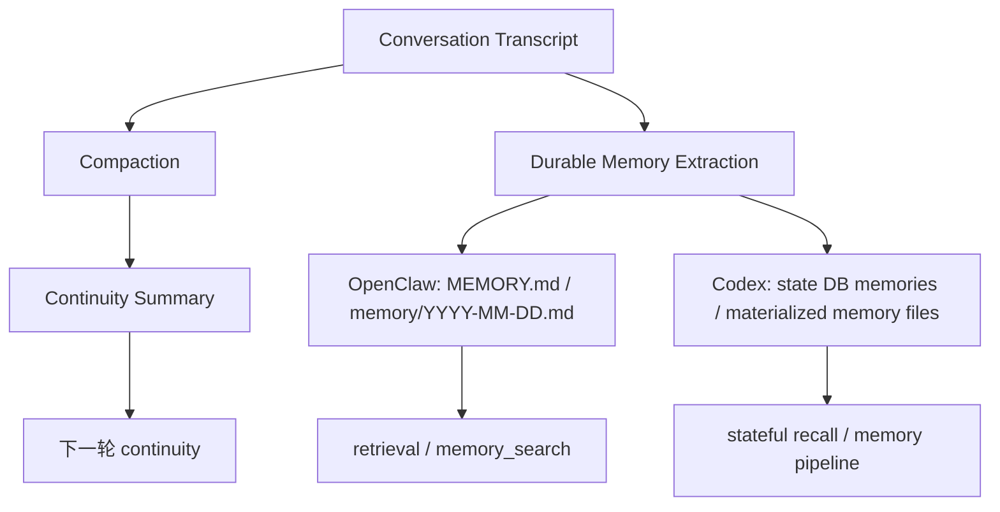

# Memory System Research

## 研究范围

本文对比四套系统：

1. 当前仓库中的 AgentHost/AgentFrame memory 模型
2. ClaudeCode
3. Codex
4. OpenClaw

重点关注以下问题：

- 与 memory、session、compaction 相关的代码结构
- model 可见 context 是怎么构建的
- compaction 之后什么信息还能保留
- 跨 session 什么信息还能延续
- 为什么我们当前系统一做 compression 就会感觉“全部忘了”
- 我们更好的跨 Session memory 方案应该怎么设计

---

## 执行摘要

这四套系统实际上位于同一条演化路径上的不同阶段：

- ClaudeCode：prompt-centric memory
- 我们当前系统：session-centric memory + workspace summary
- OpenClaw：file-centric memory + explicit recall tools + pre-compaction memory flush
- Codex：stateful memory pipeline + session/history/long-term memory 分层

最关键的区别在这里：

- ClaudeCode 和我们当前系统，主要还是“压缩 transcript 然后继续”
- OpenClaw 和 Codex，已经把“conversation compaction”和“durable memory”明确拆开

这层拆分，正是 OpenClaw 和 Codex 在长对话、跨重启、跨 Session 场景下明显更稳定的原因。

---

## 总览对比

| 系统 | 短期 context | compaction 结果 | 跨 Session memory | durable memory 形态 | retrieval 路径 |
| --- | --- | --- | --- | --- | --- |
| 我们当前系统 | `session.agent_messages` | 用 summary + recent tail 替换 model-visible transcript | 弱到中等 | workspace `summary.md`、session 文件、workspace history tools | prompt 提示 + workspace tools |
| ClaudeCode | 内存中的 conversation + context assembly | summary 替换旧 chat context | 弱 | `CLAUDE.md`、project config context、cached logs/resume | prompt/context assembly |
| OpenClaw | transcript tail + compaction entries | compaction entry 持久化到 transcript，完整 transcript 保留在磁盘 | 强 | `MEMORY.md`、`memory/YYYY-MM-DD.md`、transcripts | `memory_search`、`memory_get` |
| Codex | `ContextManager` + session state | session context 会 compact，但它不是唯一 memory 层 | 最强 | DB-backed structured memories + exported memory files + history | runtime/state/memory pipeline |

### Mermaid：四套 memory 系统差异总览

```mermaid
flowchart TD
    subgraph A["ClaudeCode"]
        A1["Conversation Transcript"]
        A2["Context Assembly<br/>README.md / CLAUDE.md / config context"]
        A3["/compact -> summary"]
        A4["继续对话时主要依赖 summary + assembled context"]
        A1 --> A3 --> A4
        A2 --> A4
    end

    subgraph B["当前系统"]
        B1["session.agent_messages"]
        B2["session.history"]
        B3["workspace summary.md"]
        B4["compaction -> summary + recent tail"]
        B5["下一轮主要看到 agent_messages"]
        B1 --> B4 --> B5
        B2 -.持久化但不自动回注.-> B5
        B3 --> B5
    end

    subgraph C["OpenClaw"]
        C1["sessions.json"]
        C2["session transcript JSONL"]
        C3["MEMORY.md"]
        C4["memory/YYYY-MM-DD.md"]
        C5["pre-compaction memory flush"]
        C6["memory_search / memory_get"]
        C2 --> C5 --> C4
        C3 --> C6
        C4 --> C6
    end

    subgraph D["Codex"]
        D1["Session / ContextManager"]
        D2["history.jsonl"]
        D3["state DB memories"]
        D4["~/.codex/memories"]
        D5["memory extraction pipeline"]
        D1 --> D5
        D2 --> D5
        D5 --> D3 --> D4
    end
```

### Mermaid：四套系统如何划分边界

---

## 1. 我们当前系统

### 相关代码

- `agent_frame/src/compaction.rs`
- `agent_host/src/session.rs`
- `agent_host/src/prompt.rs`
- `agent_host/src/server.rs`
- `agent_host/src/workspace.rs`

### 基本工作方式

当前仓库里其实有三层彼此相关、但职责并不相同的数据：

1. `session.agent_messages`
   - 这是下一轮 model 主要可见的历史 context。
   - 在 `agent_host/src/server.rs` 的 `build_previous_messages_for_turn()` 中重新拼回下一次请求。

2. `session.history`
   - 这是更完整的 session 消息记录，偏产品层和会话层使用。
   - 它不会自动作为下一轮 model 的 prior context 被重新注入。

3. workspace summary
   - 每个 workspace 都会有一个 host 侧的 `summary.md`
   - 它会作为 `Current workspace summary` 注入 system prompt

### compaction 行为

compaction 的核心逻辑在 `agent_frame/src/compaction.rs`。

旧 transcript 会被总结成一条 assistant message，标记为：

- `[AgentFrame Context Compression]`

compaction 之后 session 保留的是：

- 这条 summary message
- recent messages tail
- 可选的 runtime state summary

真正关键的问题是，它是 overwrite-style 的。

在 `agent_host/src/session.rs` 中：

- `record_agent_turn()` 会把新的 `messages` 直接写回 `session.agent_messages`
- `record_idle_compaction()` 也会把 compact 之后的 `messages` 写回 `session.agent_messages`

也就是说，model 可见 transcript 会被原地替换。

### 跨 Session 行为

跨 session 时，当前系统主要依赖：

- 持久化的 session state
- workspace `summary.md`
- `agent_host/src/server.rs` 暴露的 workspace history tools

`agent_host/src/prompt.rs` 里也会提示 model：如果用户问之前的工作历史，应该去用 workspace history tools。但这只是 guidance，不是自动的 durable memory 注入层。

### 优点

- 结构简单，容易理解
- workspace summary 已经具备基本 handoff 价值
- 不需要额外依赖 vector DB 或复杂 memory service

### 缺点

- transcript compaction 和 durable memory 混在一起
- 最终能留下什么，过度依赖单条 summary message
- 容易发生 summary-of-summary 信息衰减
- 跨 session 恢复更多依赖工具检索，而不是自动 continuity
- `workspace summary` 过于宽泛，无法替代 conversation memory

---

## 2. ClaudeCode

### 相关代码

- `learnable_materials/claude-code/src/entrypoints/cli.tsx`
- `learnable_materials/claude-code/src/tools.ts`
- `learnable_materials/claude-code/src/context.ts`
- `learnable_materials/claude-code/src/utils/config.ts`
- `learnable_materials/claude-code/src/commands/compact.ts`
- `learnable_materials/claude-code/src/tools/MemoryReadTool/MemoryReadTool.tsx`
- `learnable_materials/claude-code/src/tools/MemoryWriteTool/MemoryWriteTool.tsx`

### 基本工作方式

ClaudeCode 本质上是一个 TypeScript CLI/TUI agent loop，加上一层 prompt/context assembly。

它的“memory”主要来自这些来源：

- 项目文件，比如 `README.md`
- repo 结构和 git 状态
- `CLAUDE.md`
- project config 里的 `context`
- conversation logs 和 resume 文件

这些 context 的拼装主要发生在 `src/context.ts`，配置定义在 `src/utils/config.ts`。

### tools

`src/tools.ts` 里可以看到它的工具注册大致包括：

- bash
- file read/write/edit
- grep/glob/ls
- notebook read/edit
- think
- agent tool
- MCP tools

### compaction 行为

`/compact` 的核心逻辑是总结当前 conversation，然后从 summary 继续。

所以它仍然是典型的 prompt-centric 设计：

- 新对话看到的是 summary
- 旧 turns 不再是主要的 model-visible history

### memory 行为

ClaudeCode 虽然有 `MemoryReadTool` 和 `MemoryWriteTool` 的源码文件，但默认实现里是关闭的，`isEnabled()` 返回 `false`。

所以在真实机制上，ClaudeCode 并没有像 OpenClaw 或 Codex 那样形成成熟的 long-term memory subsystem。

### 优点

- 心智模型简单
- context assembly 很灵活
- project bootstrap context 做得不错

### 缺点

- memory 仍然主要是 prompt stuffing + logs
- compaction 之后仍然会有明显“忘记”的感觉
- durable cross-session memory 没有和 transcript/context 清晰拆分

---

## 3. Codex

### 相关代码

- `learnable_materials/codex/codex-rs/Cargo.toml`
- `learnable_materials/codex/codex-rs/cli/src/main.rs`
- `learnable_materials/codex/codex-rs/core/src/project_doc.rs`
- `learnable_materials/codex/codex-rs/core/src/state/session.rs`
- `learnable_materials/codex/codex-rs/core/src/message_history.rs`
- `learnable_materials/codex/codex-rs/core/src/memories/README.md`
- `learnable_materials/codex/codex-rs/core/src/memories/start.rs`
- `learnable_materials/codex/codex-rs/core/src/memories/storage.rs`
- `learnable_materials/codex/codex-rs/state/src/model/memories.rs`
- `learnable_materials/codex/codex-rs/state/src/runtime/memories.rs`

### 基本工作方式

Codex 的核心特点是分层非常明确。

高层上它至少拆成了四层：

1. project instructions
   - 通过 `project_doc.rs` 分层加载 `AGENTS.md`

2. active session state
   - session state 和 `ContextManager` 在 `core/src/state/session.rs`

3. append-only / global history
   - 通过 `message_history.rs` 记录到 `~/.codex/history.jsonl`

4. long-term memory pipeline
   - 从历史 rollout 抽取 structured memory
   - 落入 SQLite
   - 再 materialize 成 `~/.codex/memories` 下的 memory 文件

### tools

Codex 的 tool surface 明显更重：

- shell execution
- `write_stdin`
- `apply_patch`
- image/file helpers
- MCP resource browsing
- user input tools
- multi-agent tools，比如 `spawn_agent`、`send_input`、`wait_agent`

工具定义和 runtime handler 也是拆开的。

### memory 行为

Codex 最重要的设计选择就是把三类东西彻底分开：

- session context 不是 long-term memory
- history 不是 extracted memory
- extracted memory 进入独立的 state tables / files

它的 memory pipeline 是 phase-based 的：

1. 从过去的 rollout 中抽取 structured memory
2. 写入 state DB
3. 产出可消费的 memory artifacts 到磁盘

### 优点

- separation of concerns 最完整
- durable memory pipeline 可审计、可检查
- 非常适合 long-lived agent 和多 Session continuity

### 缺点

- 工程复杂度明显更高
- state model 对很多项目来说偏重
- 运行时和调试成本更高

---

## 4. OpenClaw

### 相关代码

- `learnable_materials/openclaw/docs/concepts/memory.md`
- `learnable_materials/openclaw/docs/concepts/compaction.md`
- `learnable_materials/openclaw/docs/reference/session-management-compaction.md`
- `learnable_materials/openclaw/extensions/memory-core/index.ts`
- `learnable_materials/openclaw/extensions/memory-core/src/tools.ts`
- `learnable_materials/openclaw/extensions/memory-core/src/prompt-section.ts`
- `learnable_materials/openclaw/extensions/memory-core/src/flush-plan.ts`
- `learnable_materials/openclaw/extensions/memory-core/src/short-term-promotion.ts`
- `learnable_materials/openclaw/packages/memory-host-sdk/src/host/session-files.ts`

### 基本工作方式

OpenClaw 把 memory 设计成显式、file-based 的能力。

它把以下几层区分得很清楚：

1. session store
   - `sessions.json`

2. transcript persistence
   - append-only 的 `<sessionId>.jsonl`

3. workspace 里的 memory files
   - `MEMORY.md`
   - `memory/YYYY-MM-DD.md`

4. memory retrieval tools
   - `memory_search`
   - `memory_get`

### compaction 行为

OpenClaw 会把 compaction 结果持久化进 transcript，而不是只替换某个内存中的 transcript 缓冲区。

从 compaction 文档可以看到三点：

- recent messages 会保留
- compaction summary entry 会被持久化
- 完整 history 仍然保存在磁盘

这并不意味着 model 下一轮能自动看到完整历史，但它避免了把一切都折叠进一个可变 session 字段里。

### compaction 之前的 memory flush

这是 OpenClaw 最值得我们直接借鉴的点。

在 compaction 之前，OpenClaw 会运行一次 silent 的 pre-compaction memory flush。`extensions/memory-core/src/flush-plan.ts` 里明确要求 agent：

- 把 durable memories 写入 `memory/YYYY-MM-DD.md`
- 只能 append，不要覆盖
- 把 bootstrap files 当作 read-only
- 如果没有需要保存的内容，就 silent reply

这说明 OpenClaw 不会把 transcript summary 当成唯一的 memory 保底机制，它会先问一个更本质的问题：

- 哪些信息必须在 chat 被 compact 之前，先沉淀成 durable memory？

### memory retrieval

OpenClaw 还会通过 `prompt-section.ts` 把 recall 行为写进 prompt：

- 回答 prior work / history 类问题之前，先运行 `memory_search`
- 再用 `memory_get` 拉取精确片段

这比“指望 model 自己记住 transcript”强很多，因为它是 retrieval-first 的。

### short-term 到 long-term 的 promotion

OpenClaw 还有一个实验性的“dreaming”路径，相关逻辑在 `short-term-promotion.ts`：

- 会跟踪 recall frequency 和 query diversity
- 高频被 recall 的 daily memory 片段，后续可以被 promote 到 long-term memory

这是一种很实用的中间方案：

- 比纯文件更聪明
- 但又没有 Codex 那么重

### transcript indexing

`packages/memory-host-sdk/src/host/session-files.ts` 显示，OpenClaw 还可以把 transcript files 也作为 memory/search 输入，提取其中的 user/assistant text 用来索引。

所以它同时拥有两类检索源：

- 显式 memory files
- 可搜索 transcript artifacts

### 优点

- durable memory 是 first-class、human-readable 的
- compaction 和 durable memory 是显式拆开的
- pre-compaction memory flush 可以直接缓解 context loss
- retrieval tools 让历史访问变成可解释、可审计的流程
- file-based 方案比完整 DB memory system 更容易落地

### 缺点

- 仍然依赖 agent 是否能写出高质量 memory notes
- file memory 如果缺少 consolidation，容易逐渐变噪
- 结构化程度不如 Codex 的 DB-backed pipeline

### OpenClaw 的 filesystem / workspace 共享机制

这一部分是 OpenClaw 很容易被误解的地方。

它并不是“所有 session 共用一个目录”这么简单，而是至少分成四类存储：

1. agent workspace
   - 这是 agent 的主工作目录，默认在 `~/.openclaw/workspace`，也可以按 agent 单独配置。
   - 里面放 `AGENTS.md`、`SOUL.md`、`USER.md`、`IDENTITY.md`、`TOOLS.md`、`MEMORY.md`、`memory/YYYY-MM-DD.md` 等。
   - 它是 memory 与 bootstrap context 的核心来源。

2. agent state / session store
   - 在 `~/.openclaw/agents/<agentId>/...`
   - 包括 `sessions.json`、`<sessionId>.jsonl`、auth profiles 等。
   - 这些不属于 workspace，也不建议进入 workspace repo。

3. sandbox workspace
   - 当 sandbox 开启且 `workspaceAccess != "rw"` 时，tool 实际操作的是 sandbox workspace，而不是 host 上的 agent workspace。
   - 路径位于 `agents.defaults.sandbox.workspaceRoot` 下。
   - 根据 `scope` 不同，这个 workspace 可以是 per-session、per-agent、或 shared。

4. remote workspace
   - 在 SSH / OpenShell backend 下，还会有 remote 侧 workspace。
   - 它可能只是临时 mirror，也可能成为 canonical workspace。

换句话说，OpenClaw 的文件共享边界，不是只由“是不是同一个 agent”决定，而是由这几个维度共同决定：

- agent 是否相同
- sandbox 是否开启
- `scope` 是 `session` / `agent` / `shared`
- `workspaceAccess` 是 `none` / `ro` / `rw`
- backend 是 `docker` / `ssh` / `openshell`
- OpenShell 是 `mirror` 还是 `remote`

### 1. agent workspace 是谁共享

从 `docs/concepts/agent-workspace.md` 和 `src/agents/workspace.ts` 看，agent workspace 是 OpenClaw 的“主记忆目录”。

它的共享规则是：

- 同一个 agent 的多个 session，默认共享同一个 agent workspace
- 不同 agent 默认不共享 workspace
- 不同 agent 也不共享 auth profiles 和 session store

所以在 multi-agent 模型里：

- `workspace` 是 per-agent 的
- `sessions` 是 per-agent 的
- `auth-profiles.json` 也是 per-agent 的

这点很重要，因为它意味着：

- 同一个 agent 的 DM、group、cron session 可以共享同一份 `MEMORY.md`
- 但不同 agent 之间不会天然共享 memory files

### 2. session store / transcript 怎么共享

session state 明确挂在 `~/.openclaw/agents/<agentId>/sessions/` 下：

- `sessions.json`
- `<sessionId>.jsonl`

共享规律是：

- 同一个 agent 的所有 session 共用同一个 session store 目录
- 但每个 session 有各自独立 transcript
- compaction summary 也落在 transcript 里，而不是落在 workspace 里

所以 transcript continuity 是 per-session 的，而 workspace memory 是 per-agent 的。

### 3. sandbox scope 决定 sandbox workspace 到底怎么共享

`docs/gateway/sandboxing.md`、`src/agents/sandbox/config.ts`、`src/agents/sandbox/context.ts`、`src/agents/sandbox/shared.ts` 这一组代码非常关键。

OpenClaw 支持三种 `scope`：

- `session`
- `agent`
- `shared`

它们对应的共享语义是：

- `session`
  - 每个 session 一个 sandbox runtime
  - 每个 session 一个 sandbox workspace
  - 隔离最强，文件系统彼此不共享

- `agent`
  - 同一个 agent 的所有 sandboxed session 共享一个 sandbox runtime
  - 同一个 agent 的所有 sandboxed session 共享一个 sandbox workspace
  - 不同 agent 之间不共享

- `shared`
  - 所有 sandboxed session 共用一个 sandbox runtime
  - 所有 sandboxed session 共用一个 sandbox workspace
  - 这是最强的共享模式，也是隔离最弱的模式

### Mermaid：OpenClaw sandbox scope 如何影响共享

### 4. `workspaceAccess` 决定 sandbox 看到的到底是不是 host workspace

这是 OpenClaw 文件共享里最关键的第二个维度。

`workspaceAccess` 有三种：

- `none`
- `ro`
- `rw`

#### `workspaceAccess: "rw"`

这是“直接共享 host workspace”的模式。

在 `src/agents/sandbox/context.ts` 里，若 `workspaceAccess === "rw"`：

- `workspaceDir = agentWorkspaceDir`
- tool 直接对 agent workspace 操作

这意味着：

- sandbox 内的 `/workspace` 实际映射的是 host 上的 agent workspace
- 对文件的读写会直接反映到真实 workspace
- 同一个 agent 的 session 看到的是同一份真实文件树

这是最接近“直接共享文件系统”的模式。

#### `workspaceAccess: "ro"`

这是“host workspace 只读可见，但工作目录不直接写回”的模式。

文档上说：

- agent workspace 会以 read-only 方式挂载到 `/agent`
- sandbox 自己还有一个工作目录

从代码语义上看，这时：

- 有单独的 sandbox workspace
- tool 的主工作目录不再是 host agent workspace
- 但 host agent workspace 仍然以只读方式暴露给 sandbox

所以它是：

- 能看真实 workspace
- 但不能直接改真实 workspace

#### `workspaceAccess: "none"`

这是隔离最强的模式。

这时：

- tool 只看到 sandbox workspace
- OpenClaw 会 seed 一些 bootstrap files 进去
- 还会把 eligible skills 镜像进去
- inbound media 也会拷贝进 sandbox workspace

但 host agent workspace 本身不会直接暴露给 tool。

### Mermaid：OpenClaw 的 workspaceAccess 决定谁是 canonical workspace

### 5. sandbox workspace 是如何生成和命名的

从 `src/agents/sandbox/shared.ts` 可以看出：

- `scope=session` 时，用完整 `sessionKey` 生成 slug，再在 `workspaceRoot` 下建独立目录
- `scope=agent` 时，会把 scope key 归一成 `agent:<agentId>`
- `scope=shared` 时，scope key 直接是 `"shared"`

所以实际效果是：

- `session` scope：目录按 sessionKey 派生
- `agent` scope：目录按 agentId 派生
- `shared` scope：所有人都落在同一个共享目录

### 6. sandbox workspace 初始内容从哪来

`src/agents/sandbox/workspace.ts` 里能看到，OpenClaw 不会把整个 host workspace 全量复制过去，而是先 seed 一批 bootstrap files：

- `AGENTS.md`
- `SOUL.md`
- `TOOLS.md`
- `IDENTITY.md`
- `USER.md`
- `BOOTSTRAP.md`
- `HEARTBEAT.md`

之后再调用 `ensureAgentWorkspace(...)`，并在某些模式下同步 skills。

这意味着：

- sandbox workspace 初始就能拿到 agent 的基本人格与规则文件
- 但它不是 host workspace 的完整镜像
- `MEMORY.md` / `memory/*.md` 的长期行为更依赖后续 memory tool / memory flush / file sync 机制，而不只是 seed

### 7. 同一个 agent 的不同 session 到底共不共享 memory files

这个问题不能只回答“共享”或“不共享”，要分情况：

- 不开 sandbox，或 `workspaceAccess=rw`
  - 共享同一个 agent workspace
  - 也就共享 `MEMORY.md` 和 `memory/YYYY-MM-DD.md`

- 开 sandbox，`workspaceAccess=none`，`scope=session`
  - 每个 session 各有 sandbox workspace
  - 运行时文件系统不共享
  - 但 session 仍可能通过 memory plugin / transcript indexing 检索到同一 agent 的 memory sources

- 开 sandbox，`workspaceAccess=none`，`scope=agent`
  - 同 agent 的 sandboxed sessions 共用一个 sandbox workspace
  - 因而运行时也共享这份 sandbox 内文件树

- 开 sandbox，`scope=shared`
  - 所有 sandboxed sessions 共享同一个 sandbox workspace

所以 OpenClaw 的“共享”其实有两层：

- memory source 层：同 agent 往往共享同一套 agent-level memory files 与 session store
- runtime workspace 层：是否共享，要看 `scope + workspaceAccess`

### 8. subagent / sessions_spawn 的 workspace 继承规则

从 `src/agents/subagent-spawn.workspace.test.ts` 和 `src/agents/tools/sessions-spawn-tool.ts` 可以看出：

- same-agent spawn：默认继承当前请求者的 workspace
- cross-agent spawn：切到 target agent 自己的 workspace

而 `src/agents/pi-embedded-runner/run/attempt.thread-helpers.ts` 又说明：

- 当 sandbox 开启且 `workspaceAccess != "rw"` 时，`sessions_spawn` 会把 spawned workspace 解析回真实的 `resolvedWorkspace`
- 也就是说，spawn 行为不会盲目继承一个临时 sandbox path 作为长期 workspace identity

这说明 OpenClaw 在 subagent 场景里，把“运行时 sandbox 工作目录”和“逻辑上的 agent workspace”区分得非常清楚。

### 9. SSH / OpenShell backend 下文件系统如何共享

这又是另一层复杂度。

#### SSH backend

`docs/gateway/sandboxing.md` 明确写了：

- 第一次创建后，会把 local workspace seed 到 remote
- 之后 remote workspace 成为 canonical
- OpenClaw 不会自动把 remote changes sync 回 local

所以 SSH backend 是：

- 一次 seed
- 后续 remote-canonical
- host 和 remote 不自动双向同步

#### OpenShell `mirror` 模式

- local workspace 仍然是 canonical
- exec 前 local -> remote
- exec 后 remote -> local

这是“共享逻辑最强”的一种 remote 模式，因为 host 与 remote 会持续同步。

#### OpenShell `remote` 模式

- 初次 seed 后，remote workspace 成为 canonical
- 后续直接在 remote 上读写
- 不自动 sync 回 local

所以它更接近 SSH backend，只是由 OpenShell 管生命周期。

### Mermaid：OpenClaw 的 filesystem / state 全景

### 10. 对 OpenClaw 文件共享模型的一句话总结

OpenClaw 不是“每个 session 一份独立 workspace”，也不是“所有 session 永远共享同一个 workspace”，而是：

- logical memory 默认是 per-agent 的
- session transcript 是 per-session 的
- runtime file visibility 由 `sandbox scope + workspaceAccess + backend mode` 共同决定

这是它能同时兼顾 continuity、隔离性、multi-agent 和 remote runtime 的根本原因。

---

## 为什么我们当前系统一压缩就像“失忆”

这是最核心的问题。

### 1. model 主要看到的是 `session.agent_messages`

下一轮请求构造历史时，走的是 `agent_host/src/server.rs` 中的 `build_previous_messages_for_turn()`，核心输入是 `session.agent_messages`。

所以这个字段其实就是 model 的工作记忆主干。

### 2. compaction 会原地覆盖这个字段

`agent_host/src/session.rs` 里的 `record_agent_turn()` 和 `record_idle_compaction()` 都会替换 `session.agent_messages`。

因此 compaction 之后，model 不再看到旧的 raw transcript，而只看到：

- 一条 summary message
- recent tail

### 3. `history` 虽然存在，但它不是 model-visible context

更完整的 session history 对产品本身有用，但它不会自动重新注入下一轮 model turn。

所以问题并不是“数据被删掉了”，而是：

- 数据虽然还在某处
- 但它已经不在 model 的 active context path 上了

### 4. summary 天然是 lossy 的

`agent_frame/src/compaction.rs` 里的总结 prompt 本来就追求 concise，而且 completion 也有上限。

这适合 continuity，不适合承担全部 durable memory 的职责。

### 5. 会发生 summary-of-summary 衰减

因为 compaction 的产物本身也只是普通 assistant message，所以后续 compaction 还有机会再次压缩这些旧 summary。

信息就会继续衰减。

### 6. workspace summary 太宽泛，替代不了 conversation memory

`agent_host/src/server.rs` 里生成的 workspace summary，重点在：

- 当前 workspace 主要是做什么的
- 里面大致已经有哪些产物
- 最近进展和大致状态
- 后续方向

这当然有价值，但它并不擅长保留这些内容：

- user preferences
- 精确 decisions
- 会话中的 pending commitments
- 细粒度 constraints
- 最近工作的具体 rationale

所以用户最容易感知到的那种“你忘了我刚刚说的重点”，在当前结构下确实很容易发生。

---

## 各系统真正划分边界的位置

### ClaudeCode 的边界

- “memory” 主要还是 assembled prompt context

### 我们当前系统的边界

- “memory” 主要还是 active session transcript + workspace summary

### OpenClaw 的边界

- transcript 用来做 conversation continuity
- memory files 用来承载 compaction 之后仍需保留的 durable facts

### Codex 的边界

- session、history、long-term memory 是三层不同 state

真正的架构差异，核心就在这个边界划分上。

### Mermaid：为什么我们当前系统压缩后更像“失忆”

### Mermaid：OpenClaw / Codex 为什么更稳

---

## 我们仓库的跨 Session memory 更优方案

这里有三条现实可行的路线。

### 方案 A：最小化 durable conversation memory

新增一个独立 artifact，按 session 或 workspace 保存：

- `conversation_memory.md`
- 或 `conversation_memory.json`

内容只放高价值、稳定的信息：

- user preferences
- 关键 constraints
- 重要 decisions
- unresolved tasks
- 重要 IDs、URLs、paths、commands
- 下次恢复时的 next steps

行为建议：

- 每次成功 turn 后做增量更新
- 后续 turn 自动注入 prompt
- 不要只把它埋在 `agent_messages` 里

这是改动最小、收益最高的第一步。

### 方案 B：OpenClaw-style file memory

直接引入显式 memory files：

- `MEMORY.md`
- `memory/YYYY-MM-DD.md`

并补上 dedicated tools：

- `memory_search`
- `memory_get`
- 可选 `memory_write` 或 background memory flush

行为建议：

- compaction 之前跑 silent memory flush
- 把 durable items 先写入 daily memory
- 在 system prompt 里明确要求：回答 prior-work / history / preference 问题前，先搜 memory

这大概率是最适合我们当前代码库的平衡点。

### 方案 C：Codex-style structured memory pipeline

构建完整 memory subsystem，包括：

- turn 之后做 memory item extraction
- structured storage
- dedupe / merge / update
- retrieval ranking
- long-term materialization

这是长期最强方案，但工程投入也最大。

---

## 推荐方向

短中期最推荐的策略是：

- 借鉴 OpenClaw，把 transcript 和 durable memory 分开
- 保留我们现有的 workspace summary 层
- 后续再逐步吸收 Codex 的结构化 extraction / consolidation 思路

换成更具体的实施语言，就是下面五步。

### Phase 1：不要再把 compaction summary 当成唯一 memory

增加一个独立于 `session.agent_messages` 的 durable memory 文件或 state object。

建议 artifact：

- 按 workspace 存：`memory/MEMORY.md`
- 按天或按 session 存：`memory/YYYY-MM-DD.md`

### Phase 2：加入 pre-compaction memory flush

在 compaction 之前：

- 让 agent 先把 durable facts 写下来
- 采用 append-only 方式
- 除非确实需要 user-visible output，否则保持 silent

这一步会直接缓解“compression = amnesia”的问题。

### Phase 3：增加 explicit recall tools

不要再把“记忆”完全押注在 transcript 上，而是直接提供：

- memory search
- memory get

同时在 system prompt 里加入规则：

- 遇到 prior-work / history / preference 类问题，先搜 memory

### Phase 4：阻止 recursive decay

已经写成 durable memory 的信息，不应该再作为普通 transcript 文本被重新 summary。

durable memory 应该：

- 存在 chat transcript 之外
- 独立注入
- 尽可能 append-only 或带版本

### Phase 5：补 promotion 和 consolidation

后续再借鉴 OpenClaw / Codex：

- 高频 recall 的 short-term notes promote 到 long-term memory
- 对过期内容做 dedupe
- 给 memory entry 增加 source metadata

---

## 对我们当前问题的更精确诊断

当前失败模式，本质上不是 persistence failure。

它更准确地说，是 active context path 的架构问题：

1. 旧 context 被 summary
2. summary 替换了 `session.agent_messages`
3. 下一轮 model 只看到被替换后的内容
4. 旧细节虽然还在磁盘某处，但不会自动 recall
5. 用户就会感知成“memory 全丢了”

所以修复方向不是简单的“多存一点日志”。

真正需要修的是：

- 把 durable memory 从 transcript compaction 中拆出来
- 让 durable memory 独立注入
- 让 retrieval 成为显式能力

---

## 建议中的目标架构

### Layer 1：Active transcript

用途：

- 正在进行中的 conversation continuity
- tool-call 局部上下文

存储：

- `session.agent_messages`

生命周期：

- 可以被积极 compact

### Layer 2：Durable conversation memory

用途：

- 必须跨 compaction 保留的事实

存储：

- workspace-local memory file
- 或 structured memory state

建议 section：

- User Preferences
- Constraints
- Decisions
- Important Facts
- Pending Work
- Next Resume Point

生命周期：

- 增量更新
- 每轮自动注入

### Layer 3：Workspace summary

用途：

- 面向未来 agent 的宽泛 handoff

存储：

- 现有 `summary.md`

生命周期：

- 在 destroy / shutdown / switch 时更新
- 后续也可以增加周期性刷新

### Layer 4：Searchable history

用途：

- 旧细节的 fallback retrieval

存储：

- session logs
- workspace snapshots
- transcript files

访问方式：

- 通过工具检索，而不是自动把全部历史塞回 prompt

---

## 最小可落地实现切片

如果要先做一个最小但真正有用的版本，建议先做这五件事：

1. 增加 `workspace_memory.md` 或 `conversation_memory.md`
2. 在 `build_agent_system_prompt()` 中自动注入它
3. 在 compaction 前增加一次 silent memory flush turn
4. 只写稳定事实，不写泛泛总结
5. 继续保留 workspace summary，作为更宽泛的一层

只做这一步，就应该能明显改善：

- 长对话 continuity
- 重启后的恢复能力
- handoff 质量
- 跨 Session recall 的稳定性

---

## 更长期的路线图

### Short term

- file-based durable memory
- pre-compaction memory flush
- durable memory prompt injection

### Medium term

- memory search / get tools
- transcript search over past sessions
- source metadata for memory entries

### Long term

- scored promotion of short-term notes
- structured memory records
- consolidation / dedup pipeline
- 可选的 DB-backed memory index

---

## 最终建议

如果从复杂度和收益比来看：

- ClaudeCode 太轻，解决不了我们真正的 continuity 问题
- Codex 非常完整，但短期内对我们来说偏重
- OpenClaw 提供了最值得直接复制的实践模板

所以最务实的路线是：

- 保留我们现有的 session / workspace 模型
- 增加一层 OpenClaw-style durable memory
- 后续再逐步加入 Codex-style 的结构化 extraction 和 consolidation

一句话总结：

我们当前系统会让 conversation 被压缩，但并没有把 durable memory 作为独立的一等产物保存和回注。这就是 compression 会表现成 amnesia 的根本原因，也是最应该先修的架构边界。
