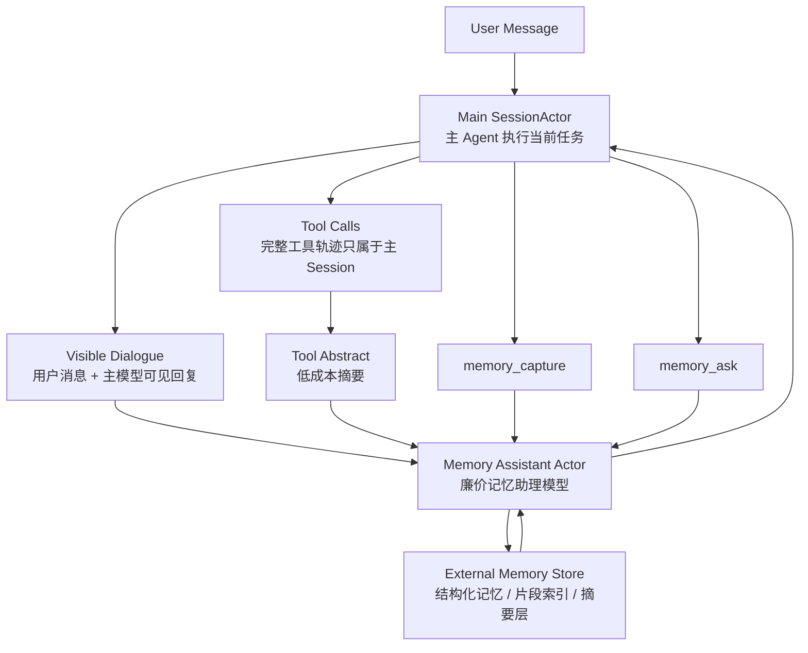

# New Memory Design Draft

本文记录一种新的 Memory 结构设想：在主 Agent 旁边引入一个廉价的“记忆助理模型”，让它作为长期对话记忆的索引、提取器和压缩器。当前内容是设计草案，不代表已实现功能。

## 核心直觉

当前主模型需要同时完成推理、工具调用、上下文维护和长期记忆使用。随着上下文变长，主模型会受到旧意图、旧工具结果和冗余日志污染，普通 compaction 又容易把重要细节一次性丢失。

新的思路是把“记忆理解”从主模型中分离出来：

- 主模型继续负责当前任务执行。
- 记忆助理模型负责旁路观察、索引、提取和回答记忆查询。
- 记忆系统不强迫所有历史都塞回主模型上下文，而是在需要时由主模型向记忆助理询问。

这相当于一种轻量 Multi-agent Memory：廉价模型不直接执行用户任务，而是作为持续运行的语义记忆索引。

## 记忆助理模型

### 可见范围

记忆助理模型默认只能看到：

- 用户与主模型之间的可见对话文本。
- 主模型最终发给用户的回复。
- 可选的工具调用 abstract，而不是完整工具参数、stdout/stderr、文件内容或中间 Agent 的全部内部轨迹。

它默认不直接看到：

- 详细工具调用内容。
- 完整工具返回值。
- 子 Agent 的内部思考或完整上下文。
- 敏感 token、密钥、cookie 等原始内容。

这样做的目的：

- 降低记忆上下文成本。
- 避免工具日志污染长期记忆。
- 减少敏感信息进入长期记忆的概率。
- 让记忆助理关注“用户意图、决策、事实、结果、未完成事项”，而不是执行过程噪声。

### 运行模式

记忆助理模型可以有两种模式：

1. 被动观察模式

   默认模式。每轮对话结束后，系统把用户与主模型的可见对话文本，以及必要的工具 abstract，追加给记忆助理。

   在这个模式下，助理模型只把对话纳入自己的上下文，不一定进行昂贵的结构化提取。

2. 激活整理模式

   当主模型认为本轮对话学到了新知识、形成了稳定结论、产生了长期计划，或发现了未来可能要查询的信息时，可以调用一个工具激活更详细的整理。

   激活后，记忆助理会对本轮或最近一段对话做更高质量的知识提取，形成可查询的记忆条目、关键词和片段引用。

## 主模型工具接口设想

### memory_capture

主模型在当前 turn 中发现值得长期保存的信息时调用。

用途：

- 告诉记忆助理：“这段对话值得详细整理。”
- 指定整理重点，例如项目事实、用户偏好、设计决策、bug 根因、未完成任务。
- 可附带简短 reason，帮助记忆助理判断为什么重要。

示例语义：

```text
memory_capture(
  reason = "用户提出了新的 Memory 架构设计，需要保留为后续实现依据",
  focus = ["architecture", "memory", "assistant model", "open questions"]
)
```

### memory_ask

主模型需要历史信息时调用。

用途：

- 向记忆助理询问是否记得相关片段。
- 让记忆助理返回答案、置信度、出处片段或建议继续检索的位置。
- 避免主模型把大量旧 transcript 重新读入当前上下文。

示例语义：

```text
memory_ask(
  query = "用户之前关于 idle compaction 的核心观点是什么？",
  expected = "brief answer with source snippets"
)
```

### tool_abstract

工具调用不直接完整进入记忆助理上下文，而是先被抽象成低成本摘要。

摘要可包含：

- 工具类别：file read、edit、exec、search、cron、subagent 等。
- 目的：为什么调用。
- 结果：成功、失败、关键发现。
- 关键引用：文件路径、任务 id、错误类别、commit id、URL。
- 是否长期重要：true / false。

不应包含：

- 大量 stdout/stderr。
- 大段文件内容。
- 原始 secret。
- 无关的中间重试细节。

## 记忆助理的数据流



## 记忆内容分层

### Layer 0: 可见对话流

原始或近似原始的用户/助手可见文本。

特点：

- 最接近真实对话。
- 成本最高。
- 只保留最近窗口，或按片段落盘。

### Layer 1: 工具抽象流

工具执行过程的结构化 abstract。

特点：

- 不保存完整工具输出。
- 保存“为什么做、做了什么、结果是什么、关键引用是什么”。
- 适合作为后续记忆检索的线索。

### Layer 2: 轮次级知识条目

由记忆助理从一轮或几轮对话中提取。

可能字段：

- `facts`: 稳定事实。
- `decisions`: 用户或系统已确认的设计决策。
- `preferences`: 用户偏好。
- `tasks`: 未完成事项。
- `risks`: 已知风险和坑。
- `refs`: 文件路径、会话 id、任务 id、URL、commit。
- `source_spans`: 对应可见对话片段引用。
- `confidence`: 置信度。
- `expires_at` 或 `staleness`: 是否容易过期。

### Layer 3: 主题级摘要

当某类记忆条目越来越多时，按主题压缩。

例子：

- Session Actor 架构设计。
- Cron 安全机制。
- Remote tools 问题。
- DingTalk channel 集成。
- 新 Memory 结构设计。

### Layer 4: 高层长期画像

极高层、低频更新的长期记忆。

例子：

- 用户长期偏好。
- 项目架构原则。
- 反复出现的问题模式。
- 已确认的工程约束。

## 高层级记忆压缩

当记忆助理自己的上下文接近上限时，不能简单丢弃旧内容。需要把旧内容结构化并存储到外部。

可能策略：

1. 片段落盘

   把旧的可见对话片段和工具 abstract 作为 immutable chunk 存储，只在需要时检索。

2. 主题摘要

   记忆助理把多个 chunk 归并成主题摘要，摘要里保留 source span 引用。

3. 知识图谱式索引

   用实体、关系、主题、时间、会话 id 做索引，例如：

   - `User -> prefers -> actor-owned session state`
   - `CronTool -> risk -> stale intent deletion`
   - `IdleCompaction -> issue -> tied to Anthropic cache TTL`

4. 混合检索

   外部 store 同时支持关键词检索、向量检索和结构化字段过滤。记忆助理负责把检索结果解释成主模型可用的回答。

## 查询行为

主模型查询记忆时，不应该直接拿回一大段历史，而是得到可操作答案。

理想返回：

- 简短结论。
- 相关原文片段或片段 id。
- 置信度。
- 是否需要打开完整 transcript。
- 是否可能过期。

示例：

```json
{
  "answer": "用户希望 SessionManager 只作为 factory/registry，不处理用户消息、turn commit 或 background delivery。",
  "confidence": "high",
  "sources": [
    {
      "type": "conversation_span",
      "id": "span_2026_04_17_session_actor_refactor_03",
      "summary": "用户明确说明 SessionManager 不应接收用户消息。"
    }
  ],
  "needs_full_transcript": false,
  "staleness": "stable_architecture_decision"
}
```

## 可行性判断

这个方案是可行的，并且和当前 SessionActor 架构方向兼容。

优点：

- 主模型不用长期携带全部历史。
- 旧工具日志不会持续污染主上下文。
- 记忆检索可以变成显式行为，减少模型凭空回忆。
- 廉价模型可以承担大量低风险整理工作。
- 记忆结构可以逐步从上下文内记忆升级为外部结构化存储。

风险：

- 记忆助理可能提取错误，需要 source span 和置信度。
- 如果只看可见对话，可能漏掉工具内部关键事实，因此 tool abstract 的质量很重要。
- 主模型可能忘记调用 `memory_capture`，所以还需要自动触发策略。
- 记忆助理上下文本身也会爆，需要外部 store 和分层压缩。
- 需要明确隐私和敏感信息过滤边界。

## 自动触发策略设想

即使主模型没有主动调用 `memory_capture`，系统也可以自动判断是否需要整理。

触发信号：

- 用户明确表达偏好、设计原则或长期约束。
- 当前 turn 产生了新的架构决策。
- 当前 turn 修复了重要 bug，并确认 root cause。
- 当前 turn 创建、删除、修改了 cron/background/subagent 等长期运行实体。
- 当前 turn 出现高风险工具调用或失败恢复。
- 当前 turn 超过一定 token 数。
- 当前 turn 结束时工具 abstract 数量较多。

触发等级：

- `observe_only`: 只追加到记忆助理上下文。
- `extract_light`: 提取少量 facts/tasks/refs。
- `extract_deep`: 做完整结构化整理。
- `promote_topic`: 合并到主题级摘要。

## 待设计问题

1. 记忆助理是每个 Conversation 一个，还是每个 Workspace 一个？
2. 记忆助理是否应该是 SessionActor 的一种特殊类型？
3. 主模型查询记忆时，是否允许记忆助理再访问外部 store？
4. 外部 store 用 JSON、SQLite、Qdrant/向量库、普通 markdown，还是混合？
5. source span 如何编号，如何从压缩摘要回到原始片段？
6. 工具 abstract 由 runtime 生成，还是由模型生成，或二者结合？
7. 记忆助理是否需要看到 background agent 的最终结果？
8. 子 Agent 的结果进入记忆时，保留最终 summary 即可，还是也需要 subagent tool abstract？
9. 如何处理过期记忆、冲突记忆和用户纠正？
10. 记忆查询结果是否自动进入当前主模型上下文，还是必须由主模型显式采用？

## 初步实现路线

### Phase 1: 旁路观察

- 新增 Memory Assistant Actor。
- 每轮结束后，把可见用户/助手文本和工具 abstract 发送给它。
- 不改变主模型上下文构造。

### Phase 2: 主动捕获与查询工具

- 给主模型增加 `memory_capture`。
- 给主模型增加 `memory_ask`。
- 记忆助理先用自己的上下文回答，不接外部 store。

### Phase 3: 外部结构化存储

- 设计 memory chunk、source span、knowledge item、topic summary schema。
- 记忆助理上下文接近上限时，把旧内容压缩并落盘。
- 查询时先检索外部 store，再由记忆助理综合回答。

### Phase 4: 自动策略

- runtime 根据 turn 事件自动决定 observe/extract/promote。
- 对高风险工具、长期任务、架构决策做更强整理。
- 和现有 compaction 机制联动：主上下文压缩时，重要信息应已经进入 Memory Assistant 或外部 store。

## 与现有架构的关系

这个设计不替代现有 SessionActor，而是在 SessionActor 旁边增加一个记忆维度：

- Conversation 仍然拥有 workspace、routing、attachment materialization 和前台 actor ref。
- SessionActor 仍然拥有当前会话状态、mailbox、interrupt、progress、turn commit。
- Memory Assistant Actor 只负责记忆观察、整理和查询，不应该决定当前 turn 如何执行。
- SessionManager 仍然只作为 actor factory/registry，不应该变成 memory coordinator。

理想上，Memory Assistant 是一个特殊的 Actor，可以被 Conversation 找到，也可以被 SessionActor 通过显式接口调用。
