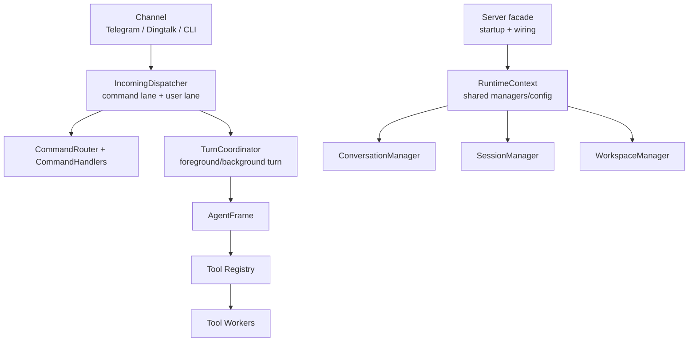

# Optimization Plan

本文件只记录当前 `main` 分支后续优化计划。已经完成的重构只保留为基线说明，避免继续围绕旧任务打转。

注意：仓库里仍有一个历史误拼文件 `OPTMIZATION_PLAN.md`。当前有效文件是 `OPTIMIZATION_PLAN.md`，误拼文件不应再作为计划来源。

## 已完成基线

这些行为和结构已经进入当前基线，后续重构应以它们为前提。

- 主分支已移除 ZGent 后端支持，ZGent 保留在独立 `zgent` 分支。
- `main` 只保留 `agent_frame` 后端，旧配置中的 `zgent` 会被升级/兼容到 `agent_frame`。
- slash command 已有独立控制通道，未知 `/command[@bot]` 不应再漏进用户上下文。
- conversation 级 remote workpath 已传入 `agent_frame`：
  - 每个 remote host 只允许一个 workpath。
  - `remote="<host>"` 默认使用该 host 的 workpath 作为远端 cwd。
  - 没有 workpath 时，remote file tools 只接受远端绝对路径。
  - `exec_wait/exec_observe/exec_kill` 通过 `exec_id` 继承 remote，不暴露 remote 参数。
- interactive progress 已从 SessionState 低频更新改为 host/frame 间 progress API。
- token estimation 已支持 template、tokenizer、HuggingFace cache、bubblewrap cache mount。
- system prompt 已使用组件 hash 控制刷新，避免动态内容频繁破坏 prompt cache。

## 当前模块边界

### Host

`agent_host/src/server.rs` 已完成第一轮拆分：

- `agent_host/src/server/command_routing.rs`: command 解析与路由。
- `agent_host/src/server/commands.rs`: out-of-band command handlers。
- `agent_host/src/server/incoming.rs`: incoming message dispatch。
- `agent_host/src/server/foreground.rs`: foreground turn execution。
- `agent_host/src/server/frame_config.rs`: frame config 构建。
- `agent_host/src/server/extra_tools.rs`: extra tool schema/handler 构建。

剩余问题：`ServerRuntime` 仍承担太多职责，很多模块继续把它当万能对象传递。

### AgentFrame Tooling

`agent_frame/src/tooling.rs` 已按工具族拆分：

- `agent_frame/src/tooling/args.rs`: JSON 参数读取 helper。
- `agent_frame/src/tooling/remote.rs`: remote SSH/workpath/cwd helper。
- `agent_frame/src/tooling/fs.rs`: file tools，包括 read/write/glob/grep/ls/edit。
- `agent_frame/src/tooling/exec.rs`: `exec_start/wait/observe/kill` 和 exec process metadata。
- `agent_frame/src/tooling/download.rs`: file download start/progress/wait/cancel。
- `agent_frame/src/tooling/media.rs`: image/pdf/audio/image generation tools。
- `agent_frame/src/tooling/skills.rs`: skill load/create/update。
- `agent_frame/src/tooling/runtime_state.rs`: tooling 层运行中任务状态、worker runtime、active task summary、cleanup。
- `agent_frame/src/tooling.rs`: `Tool` 类型、tool schema 渲染、web tools、registry assembly、兼容测试。

后续不要把工具族逻辑重新塞回 `tooling.rs`。

## 保护性约束

后续重构必须保护这些近期重要行为：

- 不要把 remote 执行重新变成模型手写 `ssh host '...'` 的主路径。
- 不要让 local workspace path 被当成 remote cwd。
- 不要把 `exec_wait/observe/kill` 的 remote 参数重新暴露给模型。
- 不要让 slash command 进入 LLM 用户上下文。
- 不要把 progress 重新塞回 SessionState 作为唯一反馈机制。
- 不要删除 prompt hash 层。
- 不要让 token estimation 退回粗估。
- 不要删除 config/workdir upgrade 链；runtime 可以假设升级后的最新形态，但旧数据入口仍应由 loader/upgrade 处理。

## 下一阶段优先级

| 优先级 | 主题 | 目标 | 风险 |
| --- | --- | --- | --- |
| P0 | 收敛 `ServerRuntime` | 引入 `RuntimeContext`/`ServerState`，让 `server.rs` 只负责装配和 lifecycle | 涉及引用多，需小步验证 |
| P1 | Session transcript 结构 | 区分用户可见 history 与 LLM transcript | 涉及 workdir schema，需要 upgrade |
| P1 | Config runtime 形态 | loader 负责兼容，runtime 只表达 latest config | 需要确认旧 loader 覆盖完整 |
| P2 | Prompt component 强类型化 | 用 enum/struct 替代字符串 component key | 低风险，主要改善维护性 |
| P2 | Progress event 模型整理 | 统一 thinking/compacting/tool batch/completed/failed 事件 | 易影响 Telegram 体验 |

## 目标架构



目标不是减少所有类型，而是让每个类型只有一个清楚责任。

## P0. 收敛 ServerRuntime

### 现状

第一轮拆分已经把 command routing、command handlers、incoming dispatch、foreground turn、frame config、extra tools 移出 `server.rs`。剩余问题是 `ServerRuntime` 仍像万能对象一样被各模块捕获和调用：

- conversation/workspace/session 快捷访问。
- command helper。
- prompt/model/sandbox/runtime 配置选择。
- status/admin 辅助逻辑。
- 若干测试仍直接依赖 `server.rs` 私有 helper。

### 计划

1. 引入 `RuntimeContext` 或 `ServerState`。

```rust
pub(crate) struct RuntimeContext {
    pub workdir: PathBuf,
    pub agent_workspace: AgentWorkspace,
    pub models: BTreeMap<String, ModelConfig>,
    pub main_agent: MainAgentConfig,
    pub command_catalog: CommandCatalog,
    pub conversations: Arc<Mutex<ConversationManager>>,
    pub sessions: Arc<Mutex<SessionManager>>,
    pub workspaces: WorkspaceManager,
    pub snapshots: Arc<Mutex<SnapshotManager>>,
    pub registry: AgentRegistry,
}
```

2. 让 `Server` 持有 `Arc<RuntimeContext>`。
3. command/turn/subagent/background 模块拿 context，而不是继续把 `ServerRuntime` 当万能对象。
4. 把测试所需的小 helper 移到对应模块，避免测试持续依赖 `server.rs` 私有函数。

### 完成标准

- `server.rs` 只保留 server lifecycle 和 module wiring。
- 新增 feature 时不需要在 `server.rs` 同时改多个区域。
- `cargo test --manifest-path agent_host/Cargo.toml --lib` 通过。

## P1. Session Transcript 结构收敛

### 现状

Session 里有两套历史：

- `history: Vec<SessionMessage>`：用户可见/渠道语义历史。
- `session_state.messages: Vec<ChatMessage>`：LLM transcript。

它们都必要，但命名接近，且 `SessionCheckpointData` 仍有历史兼容痕迹，容易误用。

### 计划

改名并升级 workdir schema：

```rust
struct Session {
    visible_history: Vec<SessionMessage>,
    runtime_state: DurableSessionState,
}

struct DurableSessionState {
    transcript: TranscriptState,
    turn: TurnState,
    prompt: PromptState,
    progress: Option<ProgressMessageState>,
}

struct TranscriptState {
    stable: Vec<ChatMessage>,
    pending: Vec<ChatMessage>,
}
```

需要新增 workdir upgrade：

- `history` -> `visible_history`
- `session_state.messages` -> `session_state.transcript.stable`
- `session_state.pending_messages` -> `session_state.transcript.pending`
- 清理旧 alias，如 `agent_messages`
- 更新 snapshot/export/import。

### 完成标准

- 代码里看到 `history` 时不会再猜它是 UI 历史还是 LLM transcript。
- workdir upgrade 测试覆盖旧字段迁移。
- `VERSION` 按 workdir schema policy bump patch。

## P1. Config Runtime 形态收敛

### 现状

项目已有 versioned config loaders，但 runtime 仍有一些兼容/legacy 概念残留。ZGent 移出主分支后，这块可以继续瘦身。

### 计划

1. 检查 runtime 中所有 `legacy`, `alias`, `deprecated`, `zgent` 相关分支。
2. 能放进 config loader 的兼容逻辑，迁移到 `agent_host/src/config/v0_x.rs`。
3. latest runtime struct 只表达当前支持形态。
4. TUI config editor 同步只显示当前支持字段。

### 完成标准

- `ModelConfig` 不再出现已删除 backend 的 runtime 分支。
- 旧配置仍可 load 并写回 latest。
- config tests 覆盖升级入口。

## P2. Prompt Component 强类型化

### 现状

prompt component hash 已经解决 prompt cache 频繁失效的问题，但 component key 还是字符串。

### 计划

```rust
enum PromptComponentKind {
    StaticPolicy,
    ModelCatalog,
    UserProfile,
    IdentityProfile,
    WorkspaceSummary,
    RuntimeContext,
    RemoteWorkpaths,
    PartclawMemory,
}

struct PromptComponent {
    kind: PromptComponentKind,
    content: String,
    notice: Option<String>,
    refresh_policy: RefreshPolicy,
}
```

好处：

- 避免 key typo。
- 可以在测试中枚举所有 component。
- 更容易表达哪些变化只发 notice，哪些必须重组 system prompt。

## P2. Progress Event 模型整理

### 现状

progress 已经独立于 SessionState，但 AgentFrame event、Host progress renderer、Telegram draft/edit message 三者概念还可以更清楚。

### 计划

```rust
enum RuntimeProgressEvent {
    Thinking,
    Compacting,
    ToolBatchStarted(Vec<ToolSummary>),
    ToolBatchFinished,
    Completed,
    Failed(String),
}

struct ToolSummary {
    name: String,
    short_args: String,
}
```

原则：

- 不实时刷每个工具的 completed/running 状态。
- 只在 phase 变化或 tool batch 变化时更新。
- Telegram progress message 绑定 session，重启后可清理。

## 不做事项

- 不把 managers 合并成一个巨大 manager。
- 不把 `ConversationManager` 和 `SessionManager` 合并。
- 不把 `Tool` 和 `ToolWorkerJob` 合并。
- 不恢复 ZGent 到 `main`。
- 不让 remote execution 回退成 prompt 里鼓励手写 ssh。
- 不为了减少类型数删除 prompt hash、token estimation、progress API 这些成本/体验护栏。

## 推荐执行顺序

1. `server` 引入 `RuntimeContext` 或 `ServerState`，继续收敛万能 `ServerRuntime`。
2. Session transcript 命名和结构升级。
3. Config runtime 形态收敛。
4. Prompt component 强类型化。
5. Progress event 模型整理。

每一步都应该单独 commit，且至少运行：

```bash
cargo test --manifest-path agent_frame/Cargo.toml --lib
cargo test --manifest-path agent_host/Cargo.toml --lib
cargo check --manifest-path agent_frame/Cargo.toml
cargo check --manifest-path agent_host/Cargo.toml
git diff --check
```
